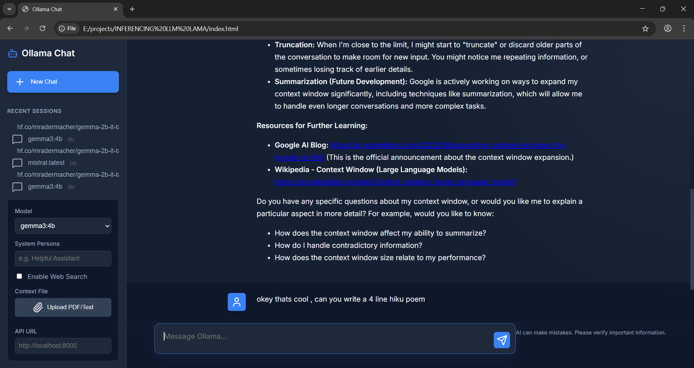

#  Local Agentic AI: The Ultimate Privacy-First LLM Platform




**Unlock the power of AI without sacrificing privacy.**

This project is a **production-ready, full-stack AI platform** that runs entirely on your local machine. It combines the power of local LLMs (via Ollama) with advanced **Agentic Capabilities** like Web Search, RAG (Document Chat), and Real-time Weather/News access.

> **Why is this important?**
> In an era where data privacy is critical, this project lets you build and use advanced AI tools that **never send your data to the cloud**. It's perfect for enterprises, researchers, and developers who need a powerful, free, and private alternative to ChatGPT.

---

##  Features that Make a Difference

###  **Agentic Web Search & Tools**
Unlike standard local LLMs, this system is **connected**. It can autonomously decide to:
- **Search the Web**: Get real-time news and information via DuckDuckGo.
- **Check Weather**: Instant weather updates for any location (OpenWeatherMap/wttr.in).
- **Consult Wikipedia**: Pull accurate summaries for definitions and historical figures.
- **Person Search**: Specifically targets LinkedIn and professional sources to avoid hallucinations about people.

###  **RAG (Chat with your Data)**
Upload **PDFs** or **Text files** directly in the UI. The system instantly indexes them, allowing you to ask questions about your specific documents. Perfect for legal contracts, research papers, or internal documentation.

###  **Modern, Beautiful UI**
Forget command lines. We provide a stunning, **Glassmorphism-styled Web Interface** with:
- **Dark Mode** by default.
- **Streaming Responses** (Typewriter effect).
- **Syntax Highlighting** for code blocks.
- **Mobile Responsive** design.

###  **Smart Memory & Personas**
- **Context-Aware**: Remembers your conversation history.
- **System Personas**: Define who the AI is (e.g., 'You are a Senior Python Engineer' or 'You are a Pirate').

---

## 🎯 Real-World Use Cases

### 🔒 Privacy-First Corporate Chatbots
Deploy an internal chatbot for employees that runs entirely on-premise. No data leaves your network. Perfect for handling sensitive HR data or proprietary code.

### 🧪 Research & Prototyping
Quickly test different prompts and models against the same API interface without rewriting code. Compare Llama 3 vs Mistral instantly.

### 📚 RAG (Retrieval-Augmented Generation) Systems
Use this API as the generation engine. Feed retrieved documents into the context window via the chat endpoint to chat with your PDFs and text files.

### 🤖 AI Agents & Assistants
Give your software agents a "brain". The session memory allows agents to retain instructions over a sequence of tasks, while tools like Web Search give them "hands".

### 📱 Mobile App Backend
Serve LLM features to mobile apps without managing heavy model weights on the device itself.

### 👨‍💻 For Developers & Students
- **Offline Coding Assistant**: Ask for code snippets without leaking data.
- **Literature Review**: Summarize long research papers (PDFs).

---

##  Quick Start Guide (Step-by-Step)

Follow these simple steps to get your own AI running in minutes.

### Prerequisites
1.  **Install Python 3.10+**: [Download Here](https://www.python.org/downloads/)
2.  **Install Ollama**: [Download Here](https://ollama.ai/)
    *   *Run 'ollama pull llama3' (or your preferred model) in your terminal after installing.*

### Installation

**1. Clone the Repository**
\\\ash
git clone https://github.com/yourusername/local-agentic-ai.git
cd local-agentic-ai
\\\`n
**2. Set up the Environment**
\\\ash
# Create a virtual environment
python -m venv .venv

# Activate it
# Windows:
.venv\Scripts\activate
# Mac/Linux:
source .venv/bin/activate
\\\`n
**3. Install Dependencies**
\\\ash
pip install -r requirements.txt
\\\`n
**4. Run the Server**
\\\ash
python run.py
\\\`n
**5. Launch the UI**
Open your browser and go to:
 **http://localhost:8000**

---

##  How to Use

1.  **Select a Model**: Use the dropdown in the sidebar to pick any model you have installed in Ollama.
2.  **Enable Web Search**: Check the 'Enable Web Search' box if you need real-time info.
3.  **Upload Documents**: Click the 'Paperclip' icon to chat with a PDF.
4.  **Set a Persona**: Type 'You are a helpful coding assistant' in the System Persona box to guide the AI's behavior.

---

## 🔌 API & Inference Integration

You can use **Ollama Agent Zero** as a powerful backend to power your own apps (Mobile, Desktop, IoT). It exposes standard HTTP endpoints that allow you to run inference on **any model installed in Ollama** with custom **System Prompts**.

### Why use this API?
- **Universal Compatibility**: Works with any language (Python, JS, C#, Swift).
- **Full Agentic Power**: Your external apps get Web Search, RAG, and Memory for free.
- **Flexible Control**: Dynamically switch models and system prompts per request.

### Example: Python Client
```python
import requests

# 1. Create a Session with a specific Model & Persona
session = requests.post("http://localhost:8000/api/sessions", json={
    "model": "llama3",
    "system_prompt": "You are a financial analyst."
}).json()

# 2. Send a Message
response = requests.post("http://localhost:8000/api/chat", json={
    "session_id": session['session_id'],
    "message": "Analyze the market trends.",
    "use_web_search": True
}).json()

print(response['response'])
```

---

##  Tech Stack

- **Backend**: FastAPI (Python) - High performance, async support.
- **AI Engine**: Ollama - Local inference for Llama 3, Mistral, Gemma, etc.
- **Search**: DuckDuckGo Search & Wikipedia API.
- **Frontend**: Vanilla JS + HTML5 + CSS3 (No complex build steps required!).

---

##  Contributing

We believe in open-source AI. If you have ideas for new tools (e.g., Calendar integration, Email drafting), feel free to fork and submit a Pull Request!

**Star  this repo if you find it useful!**
